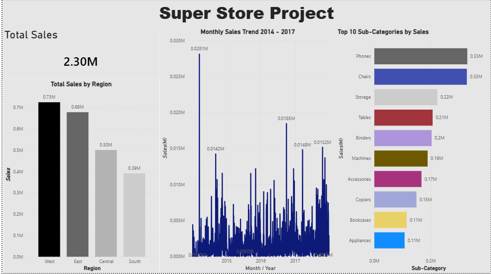

# Super Store Sales Dashboard

This is a Power BI dashboard I built to analyze 4 years of sales data from a Super Store dataset.

## What I Did
- Cleaned and loaded the data in Power BI
- Created visuals for sales by region, top products, and monthly trends
- Made a KPI card to show total sales

## Key Things I Found
1. **West region** had the highest sales at 0.73M
2. **Phones and Chairs** were the top selling products
3. **Sales peak in Nov/Dec** every year

## Tools Used
- Power BI Desktop
- Excel for the raw data

I made this to practice Power BI and data storytelling. Feel free to check the screenshot above!
